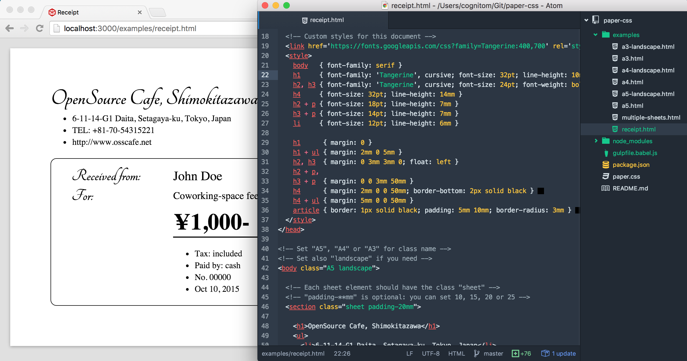

# Paper CSS for happy printing

Recently, we say "front-end" everyday. Then why we don't make the printing documents in front-end? We believe we can make it perfectly without back-end. Paper CSS is just a small snippet of the CSS, but it help us create them in browser easily.

## Previewable

You can check the design and layout before printing. See the browser like when you build a webpage.


[This example](examples/receipt.html) could be printed like this.


## Live-reloading

It's just HTML/CSS, so we can edit it with live-reloading. See [gulpfile.babel.js](gulpfile.babel.js) for more detail.



## Installation

Get paper-css from npm:

```bash
$ npm install paper-css
```

## Usage

Load paper-css into `<head>` like this:

```html
<!-- Load paper.css for happy printing -->
<link rel="stylesheet" href="dist/paper.css">

<!-- Set page size here: A5, A4 or A3 -->
<!-- Set also "landscape" if you need -->
<style>@page { size: A5 }</style>
```

Set the class of `<body>` and set also "sheet" for each sheet.

```html
<!-- Set "A5", "A4" or "A3" for class name -->
<!-- Set also "landscape" if you need -->
<body class="A5">

  <!-- Each sheet element should have the class "sheet" -->
  <!-- "padding-**mm" is optional: you can set 10, 15, 20 or 25 -->
  <section class="sheet padding-10mm">

    <!-- Write HTML just like a web page -->
    <article>This is an A5 document.</article>

  </section>

</body>
```

See also [the examples](examples/) for detail.

## Try

Download or clone this repo, then execute command bellow:

```bash
$ cd to/this/repo
$ npm install
$ npm start
```

The browser will show the receipt example automatically. Edit the file `examples/receipt.html`, you'll find the preview on the browser be reloaded each time when you save it.
