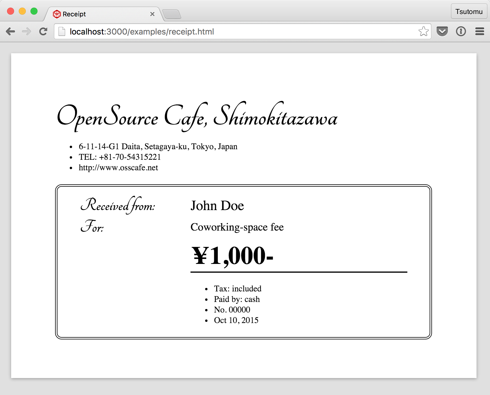
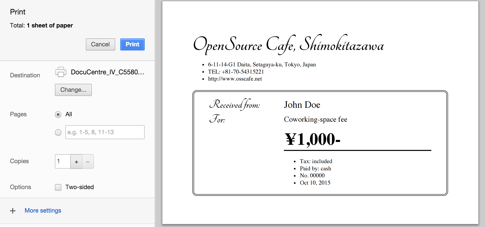

# Paper CSS for happy printing

[](https://cdnjs.com/libraries/paper-css)

> Front-end printing solution - previewable and live-reloadable!

Recently, we say "front-end" everyday. Then why don't we make the printing documents in front-end? We believe we can make it perfectly without back-end. Paper CSS is just [a small snippet of CSS](https://raw.githubusercontent.com/cognitom/paper-css/master/paper.css), but it helps us create them in browser easily.

- ***New!***: HTML --> PDF generation via CLI. [See detail here](CLI).

## Table of Contents

- [Installation](#installation)
- [Usage](#usage)
- [CLI](#cli)
  - [preview](#preview)
  - [create](#create)
  - [export](#export)
- [Try](#try)
- Why Paper CSS?
  - [Previewable](#previewable)
  - [Live-reloading](#live-reloading)
  - [Comparisons](#comparisons)
- [License](#license)

## Installation

Get Paper CSS from [cdnjs](https://cdnjs.com/libraries/paper-css) (recommended):

```html
<link rel="stylesheet" href="https://cdnjs.cloudflare.com/ajax/libs/paper-css/0.2.3/paper.css">
```

Or download [paper.css](https://raw.githubusercontent.com/cognitom/paper-css/master/paper.css) file from GitHub manually, or via npm:

```bash
$ npm install paper-css
```

## Usage

Load paper-css into `<head>` like this:

```html
<!-- Load paper.css for happy printing -->
<link rel="stylesheet" href="dist/paper.css">

<!-- Set page size here: A5, A4 or A3 -->
<!-- Set also "landscape" if you need -->
<style>@page { size: A5 }</style>
```

Set the class of `<body>` and set also "sheet" for each sheet.

```html
<!-- Set "A5", "A4" or "A3" for class name -->
<!-- Set also "landscape" if you need -->
<body class="A5">

  <!-- Each sheet element should have the class "sheet" -->
  <!-- "padding-**mm" is optional: you can set 10, 15, 20 or 25 -->
  <section class="sheet padding-10mm">

    <!-- Write HTML just like a web page -->
    <article>This is an A5 document.</article>

  </section>

</body>
```

See also [the examples](examples/) for detail.

## CLI

We have small tool for previewing and PDF generation with ease. To use Paper CSS as a CLI tool, install it in global:

```bash
$ npm install --global paper-css
```

**Note**: to use Paper CSS as just CSS, you don't have to install CLI tool.

`paper` has three subcommands:

- [preview](#preview)
- [create](#create)
- [export](#export)

### preview

Preview your HTML file with live-reloading. The command below starts the preview server and open the HTML document in your browser automatically:

```bash
$ paper preview <file>
```

You can also omit `preview` subcommand. Simply type like this:

```bash
$ paper <file>
```

If you have no document yet, check [our examples](examples/) and the next section.

**Note**: `paper preview` doesn't have any option at this point.

### create

```bash
$ paper create <file>
```

Or use this shortcut: `$ paper c <file>`

All options are optional.

- `--size` or `-s`: page size - `A4`, `A5`, `A3`
- `--padding`: padding - `10mm`, `15mm`, `20mm`, `25mm`, `none`
- `--landscape` or `-l`: landscape mode

### export

Export your HTML as PDF. The command below generates a PDF file.

```bash
$ paper export <file>
```

Or use this shortcut: `$ paper e <file>`

All options are optional.

- `--size` or `-s`: page size - `A4`, `A5`, `A3`
- `--landscape` or `-l`: in landscape orientation
- `--background` or `-b`: with background images or color
- `--wait`: waiting time (msec) before printing
- `--output` or `-o`: where to export PDF

**Note**: *the value in CSS* is prior over options above, so you don't have to set `--size` or `--landscape` basically.

Here's an example of usage:

```bash
$ paper export your-document.html --background --wait 3000 --output any/location/your-document.pdf
```

## Try

If you haven't have our CLI yet, install it:

```bash
$ npm install --global paper-css
```

Create an empty HTML document:

```bash
$ paper create first.html --size A5 --landscape

```

Open it in your favorite editor and open preview in the browser:

```bash
$ atom first.html
$ paper first.html
```

Edit the file and save your change. Then the preview will be automatically reloaded. To export it as PDF, type a command below:

```bash
$ paper export first.html
```

## Why Paper CSS?

### Previewable

You can check the design and layout before printing. See the browser like when you build a webpage.



[This example](examples/receipt.html) could be printed like this.



### Live-reloading

It's just HTML/CSS, so we can edit it with live-reloading. See [preview](#preview) section above.


### Comparisons

type | expression | learning cost | editable | in-browser | multipage
:-- | :-- | :-- | :-- | :-- | :--
HTML | Enough | already known | No | OK | ~100 pages \*
SVG | Enough | not so difficult | No | OK |
PDF | Perfect | difficult | No | NG | no limit \*\*
Excel | Not cool | *sigh* | Yes | NG | uncontrollable

\* It depends on user's environment. \*\* Only if you have huge memory on the server.

## License

MIT © Tsutomu Kawamura
